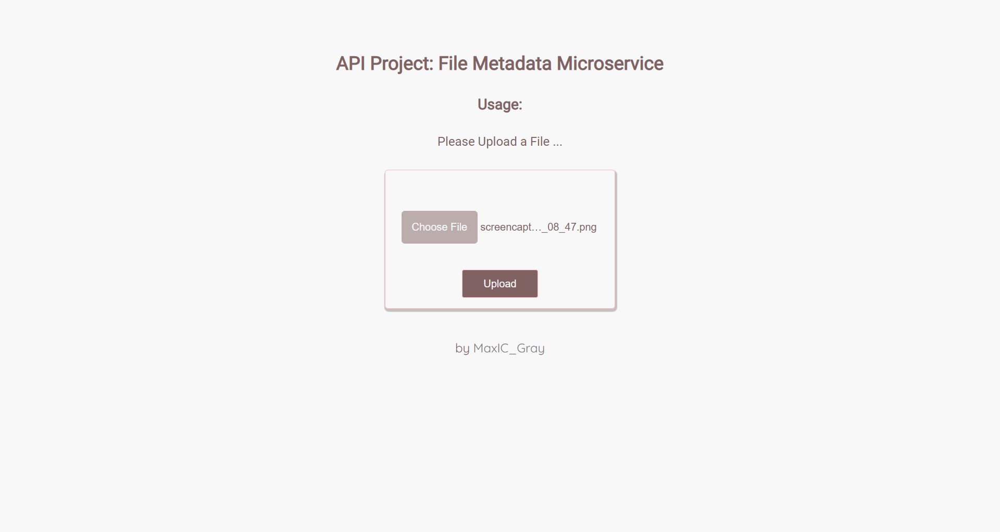

# file_metadata_microservice
----

## Stacks
- Express
- Ejs
- Multer
- Http-errors

---
## Usage

When you submit a file, you receive the file name, type, and size in bytes within the JSON response.

